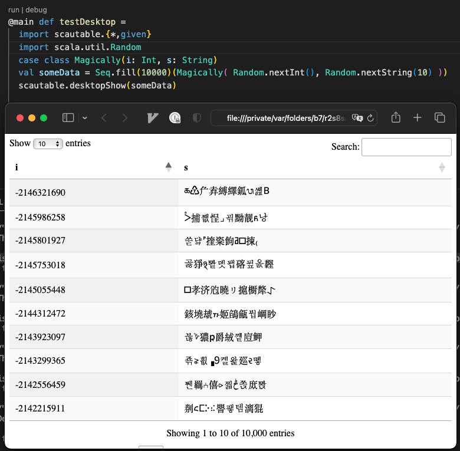

```scala

//> using dep io.github.quafadas::scautable:{{projectVersion}}

```

# In console

In scripts or conosle, fansi formatting is strongly preferred. 

```scala mdoc sc:nocompile
import io.github.quafadas.table.*

def csv = CSV.resource("simple.csv")
csv.toSeq.consoleFormatNt(fansi = false)

// This  much better in a console / script, but ugly in browser
csv.toSeq.consoleFormatNt(fansi = false)

// but this is easier to type and is equivalent to this;
csv.toSeq.ptbln

```

# In browser (currently untested with named tuples)

```scala
import io.github.quafadas.table.*

case class ScauTest(anInt: Int, aString: String)

val table = Seq(ScauTest(1, "one"), ScauTest(2, "two"), ScauTest(3, "booyakashaha!"))

println(table.consoleFormat(fancy = false))

```

On the JVM in particular, the ability to pop it open in the browser, see and search the actual data... can be useful. Particularly if you're working with a lot of messy, csv data for example.

```scala
import io.github.quafadas.table.*

case class ScauTest(anInt: Int, aString: String)
val soComplex = Seq(ScauTest(1, "one"), ScauTest(2, "two"))

scautable.desktopShow(soComplex)
```
Will pop open a browser... using https://datatables.net


And your case classes are now easily visible and searchable.

```scala


```

# Scala JS

I love scala JS, so it cross compiles, and gives you back a scalatags table. This is of questionable usefulness, but it's fun.

TODO : Laminar integration, which nobody wants but would be cool.